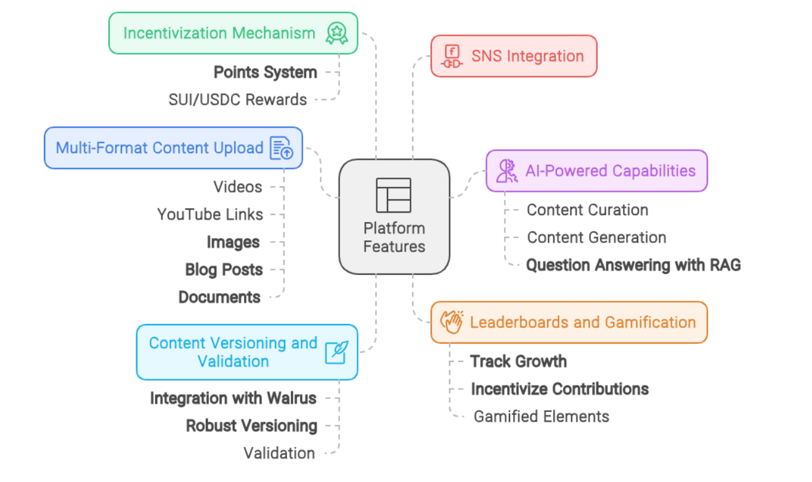
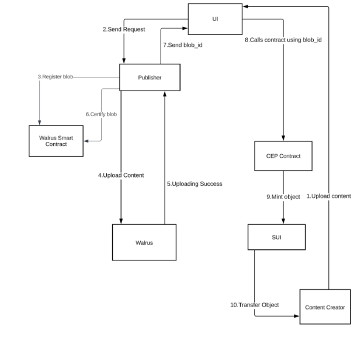
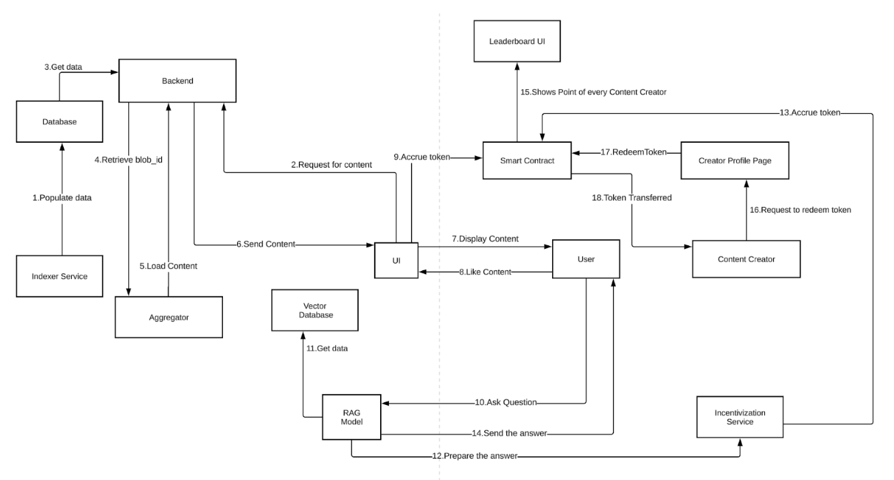

# Cre8Space - Decentralized Creator Economy Platform (DCEP)

## Overview

**Cre8Space** is a decentralized platform that empowers content creators to retain full ownership of their content, offering transparent and fair monetization opportunities through blockchain technology. The platform decentralizes used **Walrus** for content storage and management, giving creators a direct avenue for monetizing their work, collaborating with peers, and engaging their audience with transparency. Creators have direct ownership of the content they store in the platform. Powered by Sui blockchain technology and Walrus, Cre8Space provides an ecosystem that supports content authenticity, discoverability, and incentivization.

## Key Features

- **Decentralized Content Ownership**: Creators retain full control of their content, stored securely on decentralized systems.
- **Direct Content Monetization**: Token-based transactions allow creators to monetize their content directly.
- **AI-Powered Content Management**: AI-driven curation and generation ensure content reaches the right audience.
- **Content Discoverability**: Decentralized storage and AI help creators find the right audience without restrictive algorithms.
- **Content Integrity & Validation**: Blockchain-based validation ensures content authenticity and traceability.
- **Incentivization & Gamification**: Token/points system and leaderboards reward creators for active engagement and growth.

## Sui Blockchain Technology Stack

- **Walrus**: Decentralized storage and content validation for maintaining the integrity of creator content.
- **zkLogin**: Ensures secure logins and authentication for users across the platform.
- **Obfuscated NFTs**: Enable content versioning and validation while ensuring privacy.
- **Sui Name Service (SNS)**: Allows users to link their identity across various social platforms, providing seamless identity management.

## Technical Architecture

### Platform Components


1. **Multi-Format Content Upload**
   - Support for images, blogs, documents and more.
   - Unified platform for managing various content types. More content support in future.

2. **Incentivization Mechanism**
   - Token-based system for rewarding creators for content creation, curation, engagement, and interaction.
   
3. **AI-Powered Capabilities**
   - **Content Curation**: Personalized recommendations tailored to user preferences.
   - **Content Generation**: AI tools assist in content creation for images, blogs, videos, etc.
   - **Question Answering with RAG**: Provides AI-driven, accurate responses to user queries based on platform data.

4. **Leaderboards and Gamification**
   - Creator growth is tracked via leaderboards, and active participation is rewarded with gamified elements to increase community engagement.

#### File Upload flow


#### Incentivization and AI integration


## Getting Started

### Prerequisites


### Installation and Running the project
**Contract:**

Prerequisites: `sui-1.32.xx, rustc 1.79, node 20`
Running the project:
```bash
   npm install

   sui move build
   sui move test
   ts-node scripts/utils/setup.ts
```

**Backend:**

Prerequisites: `node 20, MongoDB`
Running the project:
```bash
   npm install
   npm run start
```

**Frontend:**

Prerequisites: `python: >=3.10,<3.12, Qdrant, Poetry, Cargo`
Running the project:
```bash
   yarn install
   yarn dev 
```

**AI KB:**

Prerequisites: `python: >=3.10,<3.12, Qdrant, Poetry, Cargo`
Running the project:
```bash
   poetry install
   poetry run python3 src/app/main.py
```


## Future Plans:
- **Tokenomics**: Platforms to open more contributions and support with own Token.
- **Multi-content support**: Support of more multimedia contents like Audio and Video.
- **Collaborative Creation**: Transparent co-ownership and versioning make content collaboration seamless and fair.
- **Content versioning** : Integration with Walrus ensures secure versioning of content and validation through blockchain.
- **Linking Identity via SNS**: Users can link their platform identity to their social profiles using Sui Name Service (SNS), ensuring verified, decentralized identities.
- **Fractional Ownership**: Creators can offer fractional ownership of their content, securely tracked on the blockchain.
